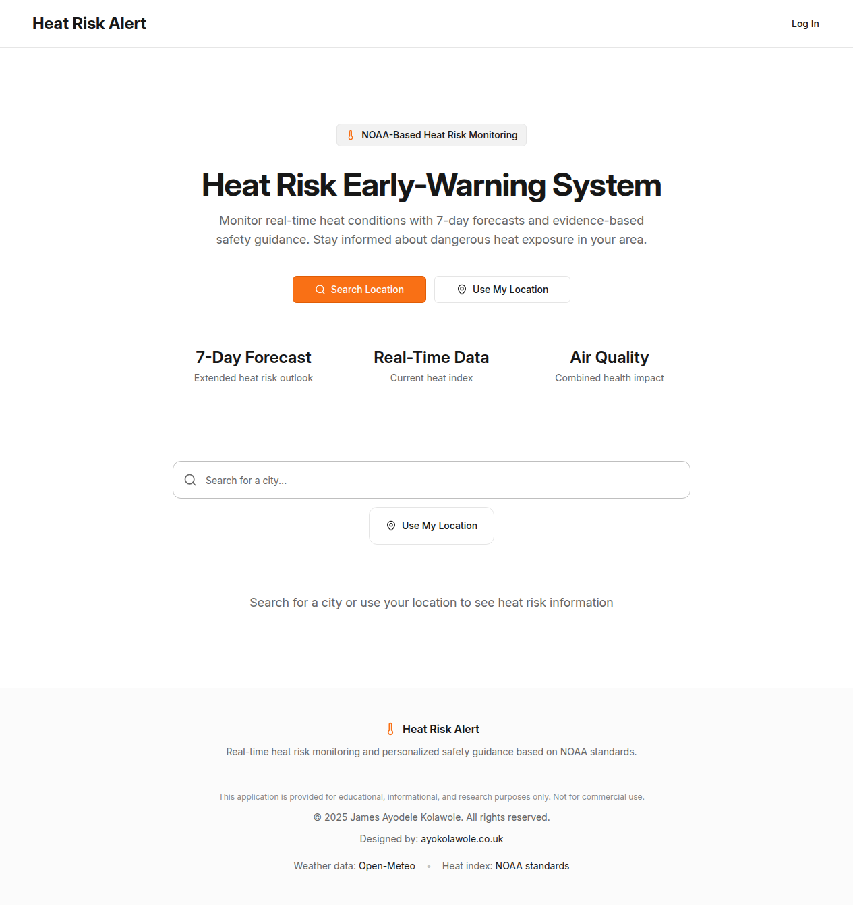

# HeatGuard - Global Air Watch

A real-time heat risk monitoring web application that provides location-based weather data, extended forecasts, heat index calculations, air quality information, and personalized safety guidance.



## Features

- **Real-Time Heat Risk Monitoring**: Live weather data with heat index calculations using the NOAA algorithm
- **7-Day Extended Forecasts**: Daily temperature highs/lows, precipitation probability, and wind conditions
- **Air Quality Integration**: EPA-standard AQI levels with health impact warnings
- **Location-Based Alerts**: Automatic geolocation detection with manual search capability
- **Saved Locations**: Store favorite locations for quick access (requires login)
- **Temperature Unit Preferences**: Toggle between Celsius and Fahrenheit
- **Risk Level Categorization**: Visual indicators for Normal, Caution, Extreme Caution, Danger, and Extreme Danger conditions
- **Health Guidance**: Personalized safety recommendations based on current conditions
- **Responsive Design**: Mobile-first approach with professional, trustworthy UI

## Tech Stack

### Frontend
- **React 18** with TypeScript
- **Vite** for fast development and optimized builds
- **TanStack Query** for server state management
- **Tailwind CSS** with shadcn/ui component library
- **Wouter** for client-side routing
- **Recharts** for data visualization
- **Framer Motion** for animations

### Backend
- **Node.js** with Express.js
- **TypeScript** for type safety
- **Drizzle ORM** for database operations
- **PostgreSQL** (Neon serverless)
- **Clerk** for authentication

### APIs
- **Open-Meteo** for weather data and air quality
- **Geocoding** for location search and reverse lookup

## Getting Started

### Prerequisites

- Node.js 18+ 
- PostgreSQL database (Neon recommended)
- Clerk account for authentication

### Environment Variables

Create a `.env` file with the following variables:

```env
DATABASE_URL=your_postgresql_connection_string
CLERK_PUBLISHABLE_KEY=your_clerk_publishable_key
CLERK_SECRET_KEY=your_clerk_secret_key
VITE_CLERK_PUBLISHABLE_KEY=your_clerk_publishable_key
SESSION_SECRET=your_session_secret
```

### Installation

1. Clone the repository:
```bash
git clone https://github.com/JkayAy/heatguard.globalairwatch.git
cd heatguard.globalairwatch
```

2. Install dependencies:
```bash
npm install
```

3. Push the database schema:
```bash
npm run db:push
```

4. Start the development server:
```bash
npm run dev
```

The application will be available at `http://localhost:5000`.

### Build for Production

```bash
npm run build
npm start
```

## Project Structure

```
├── client/                 # Frontend React application
│   └── src/
│       ├── components/     # Reusable UI components
│       ├── hooks/          # Custom React hooks
│       ├── lib/            # Utility functions
│       └── pages/          # Page components
├── server/                 # Backend Express server
│   ├── index.ts           # Server entry point
│   ├── routes.ts          # API routes
│   └── storage.ts         # Database operations
├── shared/                 # Shared types and schemas
│   └── schema.ts          # Drizzle schema definitions
└── attached_assets/        # Static assets
```

## Heat Risk Levels

The application uses NOAA's heat index algorithm to categorize risk levels:

| Level | Heat Index | Color |
|-------|------------|-------|
| Normal | < 80°F | Green |
| Caution | 80-90°F | Yellow |
| Extreme Caution | 91-102°F | Orange |
| Danger | 103-124°F | Red |
| Extreme Danger | ≥ 125°F | Purple |

## Air Quality Index (AQI)

EPA standard levels are used for air quality categorization:

| Level | AQI Range | Health Concern |
|-------|-----------|----------------|
| Good | 0-50 | Satisfactory |
| Moderate | 51-100 | Acceptable |
| Unhealthy for Sensitive Groups | 101-150 | Some may experience effects |
| Unhealthy | 151-200 | Everyone may experience effects |
| Very Unhealthy | 201-300 | Health alert |
| Hazardous | 301+ | Emergency conditions |

## API Endpoints

- `GET /api/weather` - Get current weather and forecast data
- `GET /api/geocoding/search` - Search for locations
- `GET /api/geocoding/reverse` - Reverse geocode coordinates
- `GET /api/preferences` - Get user preferences (authenticated)
- `PATCH /api/preferences` - Update user preferences (authenticated)
- `GET /api/saved-locations` - Get saved locations (authenticated)
- `POST /api/saved-locations` - Save a new location (authenticated)
- `DELETE /api/saved-locations/:id` - Delete a saved location (authenticated)

## License

MIT License

## Author

**JkayAy**

---

*Data provided by [Open-Meteo](https://open-meteo.com/) weather API and NOAA heat index algorithms.*
